# Guide méthodologique RGAA-CMS

## Thématiques
 - [1 - Interface](#t-1)
 - [2 - Options de configuration](#t-2)
 - [3 - Navigation](#t-3)
 - [4 - Consultation](#t-4)
 - [5 - Aide à la réparation](#t-5)
 - [6 - Édition](#t-6)
 - [7 - Gabarits et contenus pré-conçus](#t-7)
 - [8 - Documentation](#t-8)

---

## 1 - Interface

### Critère 1.1 [A] L'[interface](https://github.com/DISIC/referentiel-cms/blob/master/glossaire.md#Ginterface) respecte-t-elle les recommandations RGAA&nbsp;3.0 de niveau A&nbsp;?

#### Test 1.1.1

1. Tester le respect des recommandations des critères de niveau A (uniquement) du référentiel technique RGAA 3.0.
2. Si tous les critères applicables sont conformes, alors le critère est validé.

#### Commentaire
Pour valider ce critère il est nécessaire d'effectuer un audit complet d'accessibilité du CMS, à l'image d'un audit de site web, sur tous les critères de niveau A du référentiel RGAA&nbsp;3.0.

<a href="https://github.com/DISIC/referentiel-cms/blob/master/notes-techniques.md#NT-c1.1.2.3">Consulter la note technique, pour les critères 1.1, 1.2 et 1.3 relative, à la construction de l'échantillon de test.</a>

----

### Critère 1.2 [AA] L'[interface](https://github.com/DISIC/referentiel-cms/blob/master/glossaire.md#Ginterface) respecte-t-elle les recommandations RGAA&nbsp;3.0 de niveau AA&nbsp;?

#### Test 1.2.1

1. Tester le respect des recommandations des critères de niveau AA (uniquement) du référentiel technique RGAA 3.0.
2. Si tous les critères applicables sont conformes, alors le critère est validé.

#### Commentaire
Pour valider ce critère il est nécessaire d'effectuer un audit complet d'accessibilité du CMS, à l'image d'un audit de site web, sur tous les critères de niveau AA du référentiel RGAA&nbsp;3.0.

<a href="https://github.com/DISIC/referentiel-cms/blob/master/notes-techniques.md#NT-c1.1.2.3">Consulter la note technique, pour les critères 1.1, 1.2 et 1.3 relative, à la construction de l'échantillon de test.</a>

----

### Critère 1.3 [AAA] L'[interface](https://github.com/DISIC/referentiel-cms/blob/master/glossaire.md#Ginterface) respecte-t-elle les recommandations RGAA&nbsp;3.0 de niveau AAA&nbsp;?

#### Test 1.3.1

1. Tester le respect des recommandations des critères de niveau AAA (uniquement) du référentiel technique RGAA 3.0.
2. Si tous les critères applicables sont conformes, alors le critère est validé.

#### Commentaire
Pour valider ce critère il est nécessaire d'effectuer un audit complet d'accessibilité du CMS, à l'image d'un audit de site web, sur tous les critères de niveau AAA du référentiel RGAA&nbsp;3.0.

<a href="https://github.com/DISIC/referentiel-cms/blob/master/notes-techniques.md#NT-c1.1.2.3">Consulter la note technique, pour les critères 1.1, 1.2 et 1.3 relative, à la construction de l'échantillon de test.</a>

----

### Critère 1.4 [A] Chaque [fonctionnalité d'édition](https://github.com/DISIC/referentiel-cms/blob/master/glossaire.md#GfonctionnaliteEdition) dédiée à la création de contenus accessibles de niveau RGAA&nbsp;3.0 A respecte-t-elle une de ces conditions&nbsp;?

#### Test 1.4.1

1. Repérer dans l'interface les fonctionnalités dédiées à la création de contenus accessibles de niveau RGAA 3.0 A.
2. Vérifier, pour chacune de ces fonctionnalités :
	* qu'aucune autre fonctionnalité ne permet de réaliser la même action ;
	* ou que la fonctionnalité est présentée au même niveau qu'une fonctionnalité qui permet de réaliser la même action, mais de manière non accessible.
3. Si c'est le cas, le test est validé.

#### Exemple

Dans les exemples ci-dessous, il est toujours demandé l'alternative de l'image, quel que soit le mode d'ajout/édition d'une image. Cet exemple est donc conforme pour le critère 1.4.

Capture d'écran de la saisie d'une alternative lors de l'ajout d'une image, en mode texte dans l'éditeur de contenu Wordpress
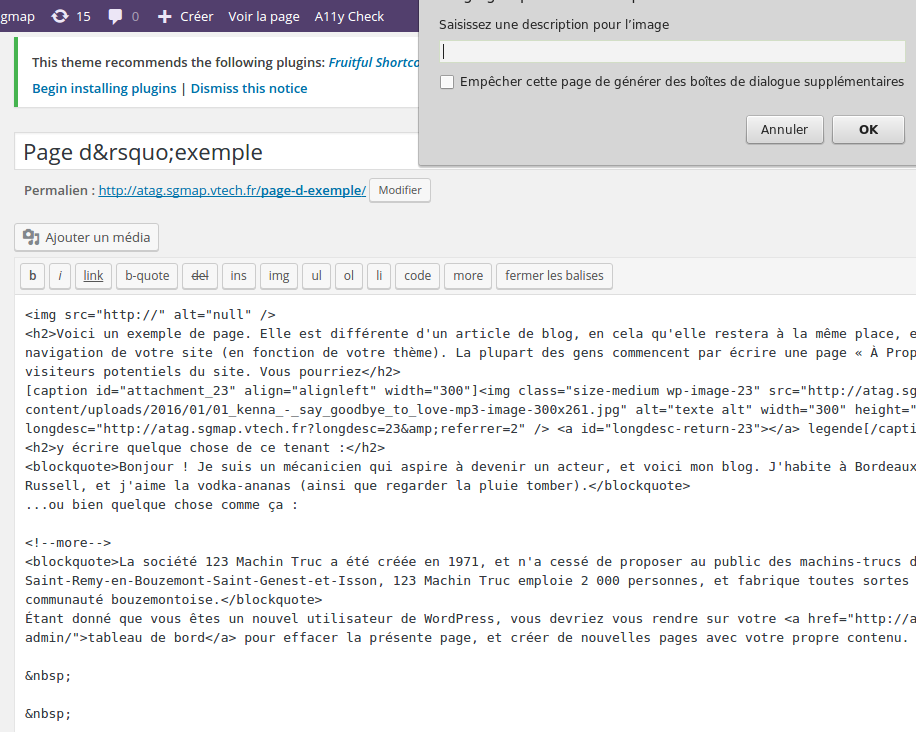

Captures d'écran de la saisie d'une alternative lors de l'ajout d'une image, en mode visuel dans l'éditeur de contenu Wordpress
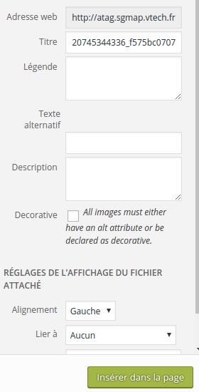
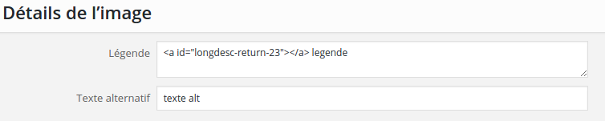

----

### Critère 1.5 [AA] Chaque [fonctionnalité d'édition](https://github.com/DISIC/referentiel-cms/blob/master/glossaire.md#GfonctionnaliteEdition) dédiée à la création de contenus accessibles de niveau RGAA&nbsp;3.0 AA respecte-t-elle une de ces conditions&nbsp;?

#### Test 1.5.1

1. Repérer dans l'interface les fonctionnalités dédiées à la création de contenus accessibles de niveau RGAA 3.0 AA.
2. Vérifier, pour chacune de ces fonctionnalités :
	* qu'aucune autre fonctionnalité ne permet de réaliser la même action ;
	* ou que la fonctionnalité est présentée au même niveau qu'une fonctionnalité qui permet de réaliser la même action, mais de manière non accessible.
3. Si c'est le cas, le test est validé.

----

### Critère 1.6 [AAA] Chaque [fonctionnalité d'édition](https://github.com/DISIC/referentiel-cms/blob/master/glossaire.md#GfonctionnaliteEdition) dédiée à la création de contenus accessibles de niveau RGAA&nbsp;3.0 AAA respecte-t-elle une de ces conditions&nbsp;?

#### Test 1.6.1

1. Repérer dans l'interface les fonctionnalités dédiée à la création de contenus accessibles de niveau RGAA 3.0 AAA.
2. Vérifier, pour chacune de ces fonctionnalités :
	* qu'aucune autre fonctionnalité ne permet de réaliser la même action ;
	* ou que la fonctionnalité est présentée au même niveau qu'une fonctionnalité qui permet de réaliser la même action, mais de manière non accessible.
3. Si c'est le cas, le test est validé.

----

### Critère 1.7 [AA] Dans l'ensemble de l'outil, les [fonctionnalités d'aide à l'accessibilité](https://github.com/DISIC/referentiel-cms/blob/master/glossaire.md#GfonctionnaiteAideAccessibilite) sont [présentées au même niveau](https://github.com/DISIC/referentiel-cms/blob/master/glossaire.md#GmemeNiveauPresentation) que les autres fonctionnalités. Cette règle est-elle respectée&nbsp;?

#### Test 1.7.1

1. Repérer dans l'interface les fonctionnalités d'aide à l'accessibilité.
2. Vérifier, pour chacune de ces fonctionnalités, que l'outil y accorde la même importance qu'aux autres fonctionnalités (l'auteur doit par exemple procéder au même nombre d'actions pour atteindre une fonctionnalité d'aide à l'accessibilité que pour atteindre les autres fonctionnalités du même ordre - correction grammaticale par exemple).
3. Si c'est le cas, le test est validé.

----

### Critère 1.8 [A] Le [contenu généré](https://github.com/DISIC/referentiel-cms/blob/master/glossaire.md#Gcontenugenere) par chaque [transformation des contenus](https://github.com/DISIC/referentiel-cms/blob/master/glossaire.md#GtransformationContenu) est-il accessible&nbsp;?

#### Test 1.8.1

1. Saisir dans un éditeur toutes les typologies de contenus proposées par l'éditeur (titre, liste, tableau, etc.).
2. Enregistrer les saisies.
3. Consulter le contenu généré et vérifier, pour chacun des contenus générés lors d'une transformation, que le code mis à disposition de l'utilisateur final respecte une de ces conditions :
	* les informations d'accessibilité de niveau RGAA 3.0 A sont préservées dans le contenu généré ;
	* les informations d'accessibilité de niveau RGAA 3.0 A sont adaptées dans le contenu généré ;
	* l'auteur est averti que des informations d'accessibilité de niveau RGAA 3.0 A seront perdues ;
	* l'outil effectue un test automatique de l'accessibilité de niveau RGAA 3.0 A ;
	* l'auteur est invité explicitement à réaliser un test de l'accessibilité de niveau RGAA 3.0 A.
4. Si c'est le cas, le test est validé.

#### Commentaire

[Consulter la note technique pour les critères 1.8, 1.9, 1.10.](https://github.com/DISIC/referentiel-cms/blob/master/notes-techniques.md#NT-c1.8.9.10)

----

### Critère 1.9 [AA] Le [contenu généré](https://github.com/DISIC/referentiel-cms/blob/master/glossaire.md#Gcontenugenere) par chaque [transformation des contenus](https://github.com/DISIC/referentiel-cms/blob/master/glossaire.md#GtransformationContenu) est-il accessible&nbsp;?

#### Test 1.9.1

1. Saisir dans un éditeur toutes les typologies de contenus proposées par l'éditeur (titre, liste, tableau, etc.).
2. Enregistrer les saisies.
3. Consulter le contenu généré et vérifier, pour chacun des contenus générés lors d'une transformation, que le code mis à disposition de l'utilisateur final respecte une de ces conditions :
	* les informations d'accessibilité de niveau RGAA 3.0 AA sont préservées dans le contenu généré ;
	* les informations d'accessibilité de niveau RGAA 3.0 AA sont adaptées dans le contenu généré ;
	* l'auteur est averti que des informations d'accessibilité de niveau RGAA 3.0 AA seront perdues ;
	* l'outil effectue un test automatique de l'accessibilité de niveau RGAA 3.0 AA ;
	* l'auteur est invité explicitement à réaliser un test de l'accessibilité de niveau RGAA 3.0 AA.
4. Si c'est le cas, le test est validé.

#### Commentaire

[Consulter la note technique pour les critères 1.8, 1.9, 1.10.](https://github.com/DISIC/referentiel-cms/blob/master/notes-techniques.md#NT-c1.8.9.10)

----

### Critère 1.10 [AAA] Le [contenu généré](https://github.com/DISIC/referentiel-cms/blob/master/glossaire.md#Gcontenugenere) par chaque [transformation des contenus](https://github.com/DISIC/referentiel-cms/blob/master/glossaire.md#GtransformationContenu) est-il accessible&nbsp;?

#### Test 1.10.1

1. Saisir dans un éditeur toutes les typologies de contenus proposées par l'éditeur (titre, liste, tableau, etc.).
2. Enregistrer les saisies.
3. Consulter le contenu généré et vérifier, pour chacun des contenus générés lors d'une transformation, que le code mis à disposition de l'utilisateur final respecte une de ces conditions :
	* les informations d'accessibilité de niveau RGAA 3.0 AAA sont préservées dans le contenu généré ;
	* les informations d'accessibilité de niveau RGAA 3.0 AAA sont adaptées dans le contenu généré ;
	* l'auteur est averti que des informations d'accessibilité de niveau RGAA 3.0 AAA seront perdues ;
	* l'outil effectue un test automatique de l'accessibilité de niveau RGAA 3.0 AAA ;
	* l'auteur est invité explicitement à réaliser un test de l'accessibilité de niveau RGAA 3.0 AAA.
4. Si c'est le cas, le test est validé.

#### Commentaire

[Consulter la note technique pour les critères 1.8, 1.9, 1.10.](https://github.com/DISIC/referentiel-cms/blob/master/notes-techniques.md#NT-c1.8.9.10)

----

### Critère 1.11 [A] Les [optimisations](https://github.com/DISIC/referentiel-cms/blob/master/glossaire.md#Goptimisation) conservent-elles les [informations d'accessibilité](https://github.com/DISIC/referentiel-cms/blob/master/glossaire.md#GinformationsAccessibilite)&nbsp;?

#### Test 1.11.1

1. Saisir dans un éditeur toutes les typologies de contenus proposées par l'éditeur (titre, liste, tableau, etc.).
2. Enregistrer les saisies.
3. Consulter le contenu généré mis à disposition de l'utilisateur et vérifier pour chacune des typologies :
	* que les optimisations (par exemple : indentation ou compression du code) ne modifient pas la structure du contenu ni les options particulières qui y sont définies ;
	* que les changements opérés lors d'une optimisation ne donnent pas lieu à une perte d'information d'accessibilité (attributs, relations programmatiques, alternatives, etc.).
4. Si c'est le cas, le test est validé.

----

### Critère 1.12 [A] Chaque fonctionnalité de [génération automatique de contenu](https://github.com/DISIC/referentiel-cms/blob/master/glossaire.md#Gcontenugenere) doit produire des contenus accessibles. Cette règle est-elle respectée ([hors cas particuliers](cas-particuliers.md#CP-c1.12.13.14))&nbsp;?

#### Tests 1.12.1, 1.12.2

1. Vérifier la présence de ces fonctionnalités de génération automatique de contenu (exemple : un système de gestion de contenu qui utilise un balisage particulier dans les zones d'édition  - la syntaxe SPIP, ou Markdown - et qui reformate en HTML en sortie).
2. Dans le cas où le contenu est généré après la session d'édition, vérifier qu'une de ces conditions est respectée (hors cas particuliers) :
	* les contenus générés sont conformes au niveau RGAA 3.0 A ;
	* l'auteur peut paramétrer la fonctionnalité pour générer des contenus conformes au niveau RGAA 3.0 A.
3. Sinon, si le contenu est généré pendant une session d'édition, vérifier qu'une de ces conditions est respectée (hors cas particuliers) :
	* les contenus générés sont conformes au niveau RGAA 3.0 A ;
	* pendant le processus de génération automatique, l'auteur est invité à renseigner des informations d'accessibilité relatives au niveau RGAA 3.0 A ;
	* à l'issue de la génération automatique de contenu, l'outil exécute un test automatique d'accessibilité de niveau RGAA 3.0 A ;
	* à l'issue de la génération automatique de contenu, l'auteur est invité à réaliser un test d'accessibilité de niveau RGAA 3.0 A.
4. Si c'est le cas, le test est validé.

----

### Critère 1.13 [AA] Chaque fonctionnalité de [génération automatique de contenu](https://github.com/DISIC/referentiel-cms/blob/master/glossaire.md#Gcontenugenere) doit produire des contenus accessibles. Cette règle est-elle respectée ([hors cas particuliers](cas-particuliers.md#CP-c1.12.13.14))&nbsp;?

#### Tests 1.13.1, 1.13.2

1. Vérifier la présence de ces fonctionnalités de génération automatique de contenu (exemple : un système de gestion de contenu qui utilise un balisage particulier dans les zones d'édition  - la syntaxe SPIP, ou Markdown - et qui reformate en HTML en sortie).
2. Dans le cas où le contenu est généré après la session d'édition, vérifier qu'une de ces conditions est respectée (hors cas particuliers) :
	* les contenus générés sont conformes au niveau RGAA 3.0 AA ;
	* l'auteur peut paramétrer la fonctionnalité pour générer des contenus conformes au niveau RGAA 3.0 AA.
3. Sinon, si le contenu est généré pendant une session d'édition, vérifier qu'une de ces conditions est respectée (hors cas particuliers) :
	* les contenus générés sont conformes au niveau RGAA 3.0 AA ;
	* pendant le processus de génération automatique, l'auteur est invité à renseigner des informations d'accessibilité relatives au niveau RGAA 3.0 AA ;
	* à l'issue de la génération automatique de contenu, l'outil exécute un test automatique d'accessibilité de niveau RGAA 3.0 AA ;
	* à l'issue de la génération automatique de contenu, l'auteur est invité à réaliser un test d'accessibilité de niveau RGAA 3.0 AA.
4. Si c'est le cas, le test est validé.

----

### Critère 1.14 [AAA] Chaque fonctionnalité de [génération automatique de contenu](https://github.com/DISIC/referentiel-cms/blob/master/glossaire.md#Gcontenugenere) doit produire des contenus accessibles. Cette règle est-elle respectée ([hors cas particuliers](cas-particuliers.md#CP-c1.12.13.14))&nbsp;?

#### Tests 1.14.1, 1.14.2

1. Vérifier la présence de ces fonctionnalités de génération automatique de contenu (exemple : un système de gestion de contenu qui utilise un balisage particulier dans les zones d'édition  - la syntaxe SPIP, ou Markdown - et qui reformate en HTML en sortie).
2. Dans le cas où le contenu est généré après la session d'édition, vérifier qu'une de ces conditions est respectée (hors cas particuliers) :
	* les contenus générés sont conformes au niveau RGAA 3.0 AAA ;
	* l'auteur peut paramétrer la fonctionnalité pour générer des contenus conformes au niveau RGAA 3.0 AAA.
3. Sinon, si le contenu est généré pendant une session d'édition, vérifier qu'une de ces conditions est respectée (hors cas particuliers) :
	* les contenus générés sont conformes au niveau RGAA 3.0 AAA ;
	* pendant le processus de génération automatique, l'auteur est invité à renseigner des informations d'accessibilité relatives au niveau RGAA 3.0 AAA ;
	* à l'issue de la génération automatique de contenu, l'outil exécute un test automatique d'accessibilité de niveau RGAA 3.0 AAA ;
	* à l'issue de la génération automatique de contenu, l'auteur est invité à réaliser un test d'accessibilité de niveau RGAA 3.0 AAA.
4. Si c'est le cas, le test est validé.

---

## 2 - Options de configuration

### Critère 2.1 [A] Chaque modification d'[une option de l'interface](https://github.com/DISIC/referentiel-cms/blob/master/glossaire.md#GconfigurationInterface) respecte-t-elle une de ces conditions&nbsp;?

#### Test 2.1.1

1. Repérer, dans l'interface, toutes les options de configuration de l'interface.
2. Modifier chaque option, et pour chacune, vérifier qu'une de ces conditions est respectée :
    * l'auteur a la possibilité d'annuler la modification (par exemple : modifier à nouveau la valeur d'un champ de saisie, réactiver un bouton désactivé) ;
    * l'auteur a la possibilité de choisir la valeur par défaut proposée par l'outil ;
    * l'auteur est averti du caractère irréversible de la modification avant son application.
3. Si c'est le cas, le test est validé.

#### Test 2.1.2

1. Repérer, parmi les fonctions de configuration de l'interface, les fonctionnalités d'aide à l'accessibilité.
2. Vérifier qu'elles ne peuvent pas être désactivées.
3. Si elles peuvent être désactivées, vérifier qu'elles peuvent être réactivées.
4. Si c'est le cas, le test est validé.

----

### Critère 2.2 [AA] Pour chaque désactivation d'une [fonctionnalité d'aide à l'accessibilité](https://github.com/DISIC/referentiel-cms/blob/master/glossaire.md#GfonctionnaiteAideAccessibilite), l'auteur est-il averti du risque d'apparition de problèmes d'accessibilité des contenus&nbsp;?

#### Test 2.2.1

1. Repérer, parmi les fonctions de configuration de l'interface, les fonctionnalités d'aide à l'accessibilité.
2. Si elles peuvent être désactivées, vérifier que l'utilisateur est averti du risque d'apparition de problèmes d'accessibilité des contenus.
3. Si c'est le cas, le test est validé

#### Exemple

Dans les `réglages > options d'écriture` (wp-admin/options-writing.php) de Wordpress, il y a une option « *WordPress doit automatiquement corriger les balises XHTML non valides* ». Le fait de déselectionner cette fonctionnalité devrait avertir l'utilisateur (via une fenêtre d'alerte par exemple) lors de la désactivation .
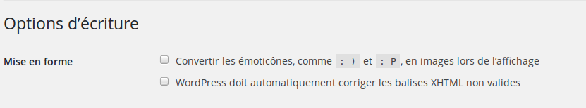

----

### Critère 2.3 [A] Toutes les [fonctionnalités d'aide à l'accessibilité](https://github.com/DISIC/referentiel-cms/blob/master/glossaire.md#GfonctionnaiteAideAccessibilite) sont-elles activées par défaut&nbsp;?

#### Test 2.3.1

1. Repérer, parmi les fonctions de configuration de l'interface, les fonctionnalités d'aide à l'accessibilité, et vérifier qu'elles sont activées par défaut.
2. Si c'est le cas, le test est validé

----

### Critère 2.4 [AAA] Les [raccourcis claviers de l'outil](https://github.com/DISIC/referentiel-cms/blob/master/glossaire.md#GraccClavier) sont-ils paramétrables&nbsp;?

#### Test 2.4.1

1. Rechercher, dans l'interface ou via la documentation, la présence de raccourcis clavier.
2. Si des raccourcis clavier sont présents, ils doivent être paramétrables.
3. Si c'est le cas, le test est validé.

#### Commentaire

Si l'interface ne propose pas de raccourcis clavier, le critère est non applicable.
Le critère est non applicable pour les raccourcis clavier de la plateforme et de l'agent utilisateur qui s'appliquent dans l'outil. Par exemple `Ctrl + S` (pour sauvegarder) ou `Ctrl + Z` (pour annuler) n'ont pas à être paramétrables.

----

### Critère 2.5 [A] Les [options de personnalisation](https://github.com/DISIC/referentiel-cms/blob/master/glossaire.md#GoptionsPresentationOutil) des [zones d'édition](https://github.com/DISIC/referentiel-cms/blob/master/glossaire.md#GzonesEdition) définies depuis l'outil n'influencent pas le [contenu généré](https://github.com/DISIC/referentiel-cms/blob/master/glossaire.md#Gcontenugenere). Cette règle est-elle respectée&nbsp;?

#### Test 2.5.1

1. Repérer, dans l'interface, les options de personnalisation des zones d'édition.
2. Pour chaque option de personnalisation des zones d'éditions :
    * saisir toutes les typologies de contenus disponibles (couleur de texte, lien, liste, titre, etc.) dans les différentes zones d'éditions ;
    * vérifier que le contenu généré n'est pas influencé par les options saisies précédemment.
3. Si c'est le cas, le test est validé.

#### Exemple

Si l'auteur définit, dans les options de personnalisation, l'affichage des liens en bleu, les liens du contenu généré ne doivent pas répondre à ce paramètre, mais à la couleur définie dans les feuilles de styles qui lui sont propres.

----

### Critère 2.6 [AA] Chaque modification par l'auteur d'une [configuration de l'interface](https://github.com/DISIC/referentiel-cms/blob/master/glossaire.md#GconfigurationInterface) est-elle sauvegardée&nbsp;?

#### Tests 2.6.1, 2.6.2

1. Repérer, dans l'interface, les options de configuration de l'interface.
2. Modifier les options de présentation et d'utilisation.
3. Vérifier, pour chacune d'entre elles, qu'elle est bien sauvegardée, même après déconnexion/re-connexion.
4. Si c'est le cas, le test est validé.

----

### Critère 2.7 [AA] Les options de personnalisation de [la plateforme](https://github.com/DISIC/referentiel-cms/blob/master/glossaire.md#Gplateforme) sont-elles reprises par défaut par l'outil&nbsp;?

#### Tests 2.7.1, 2.7.2

1. Changer les options de personnalisation de la plateforme (dans le cas d'un navigateur web, par exemple : modifier la taille de police par défaut, changer de thème ou ajouter des extensions d'accessibilité).
2. Pour chaque option de la plateforme, vérifier que, dans l'interface, il n'existe pas d'option équivalente ou qu'une option équivalente est désactivée.
3. Si c'est le cas, vérifier que l'option de la plateforme s'applique à l'interface de l'outil.
4. Si c'est le cas, le critère est validé.

---

## 3 - Navigation

### Critère 3.1 [AA] Le [balisage](https://github.com/DISIC/referentiel-cms/blob/master/glossaire.md#Gmarkup) visible dans les [zones d'édition](https://github.com/DISIC/referentiel-cms/blob/master/glossaire.md#GzonesEdition) est-il éditable&nbsp;?

#### Test 3.1.1

1. Vérifier, pour chaque zone d'édition, que :
	* le balisage visible est éditable ;
	* il existe des mécanismes de navigation dans le balisage, par exemple des raccourcis clavier permettant d'aller aux prochains titres, d'aller à la balise fermante...
2. Si c'est le cas, le test est validé.

----

### Critère 3.2 [AAA] Existe-t-il une méthode pour naviguer entre les [relations programmatiques](https://github.com/DISIC/referentiel-cms/blob/master/glossaire.md#GrelationProgrammatique) éditables des éléments des [zones d'édition](https://github.com/DISIC/referentiel-cms/blob/master/glossaire.md#GzonesEdition)&nbsp;?

#### Test 3.2.1

1. Repérer les relations programmatiques (exemple : aria-describedby -> id ou for -> id, etc...) dans les zones d'édition.
2. Vérifier qu'il existe une méthode pour naviguer entre ces relations dans les zones d'édition (exemple : un raccourci clavier, un lien - JavaScript -, etc.).
3. Si c'est le cas, le test est validé.

----

### Critère 3.3 [AA] Pour chaque zone d'édition, il existe un [mécanisme qui permet de rechercher](https://github.com/DISIC/referentiel-cms/blob/master/glossaire.md#GmecanismeRecercheContenu) dans l'ensemble du contenu éditable. Cette règle est-elle respectée&nbsp;?

#### Test 3.3.1, 3.3.2

1. Pour chaque zone d'édition, vérifier qu'il existe un mécanisme qui recherche uniquement dans le contenu de la zone d'édition.
2. Vérifier que les résultats de la recherche respectent toutes ces conditions :
	* les résultats correspondant à la recherche sont présentés à l'auteur (sous forme de liste ou mis en évidence de manière accessible dans le contenu par exemple) ;
	* un mécanisme permet de déplacer le focus sur les résultats correspondant à la recherche dans la zone d'édition ;
	* la déplacement dans les résultats de la recherche peut être effectuée d'avant en arrière, et d'arrière en avant ;
	* lorsque la recherche ne renvoie pas de résultats, l'auteur en est informé.
3. Si c'est le cas, le test est validé.

#### Commentaire :

S'assurer que le moteur de recherche propre à la zone d'édition ne renvoie pas de résultats issus de l'interface elle même.

---

## 4 - Consultation

### Critère 4.1 [A] Les contenus non textuels affichés dans les [zones d'édition](https://github.com/DISIC/referentiel-cms/blob/master/glossaire.md#GzonesEdition) sont-ils accessibles&nbsp;?

#### Test 4.1.1

1. Ajouter des contenus non textuels dans les différentes zones d'édition (exemples : image, contenu cryptique - art ascii, emoticon, syntaxe cryptique -, etc.).
2. Vérifier qu'ils sont accessibles ; par exemple, pour le cas d'une image, vérifier l'alternative textuelle.
3. Reprendre ainsi les critères du [référentiel technique RGAA 3.0](http://references.modernisation.gouv.fr/referentiel-technique-0) pour la thématique concernée et vérifier les critères applicables.

----

### Critère 4.2 [A] Chaque contenu multimédia synchronisé affiché dans une [zone d'édition](https://github.com/DISIC/referentiel-cms/blob/master/glossaire.md#GzonesEdition) est-il accessible&nbsp;?

#### Test 4.2.1

1. Dans une zone d'édition, insérer les différents types de contenus multimédias (vidéo ou fichier son par exemple).
2. Vérifier que la zone d'édition permet une consultation accessible du contenu multimédia en reprennant la thématique Multimédia du RGAA 3.0 et vérifier les critères applicables.
3. Si la consultation n'est pas accessible, vérifier qu'il existe un moyen de rendre le contenu multimédia dans un agent utilisateur qui en permet une consultation accessible (par exemple, l'interface fournit une url que l'auteur peut copier pour tester dans un autre navigateur).
4. Si c'est le cas, le test est validé.

#### Commentaire :

Si certaines zones d'édition ne permettent pas d'ajouter de contenus multimédia, ce critère est non applicable.

----

### Critère 4.3 [AA] [Les propriétés de présentation](https://github.com/DISIC/referentiel-cms/blob/master/glossaire.md#GproprietesPresentationElements) disponibles dans les [zones d'édition](https://github.com/DISIC/referentiel-cms/blob/master/glossaire.md#GzonesEdition), sont-elles accessibles&nbsp;?

#### Test 4.3.1

1. Saisir un texte dans une zone d'édition et, à l'aide des propriétés de présentation, modifiez son apparence (couleur, soulignement, etc.).
2. Vérifier, pour chaque zone d'édition, si les propriétés de présentation des éléments contenus dans les zones d'édition sont accessibles.
3. Si c'est le cas, le test est validé.

#### Exemple

Si une zone d'édition permet de définir, par exemple, une couleur, cette propriété de présentation doit pouvoir être restituée aux technologies d'assistance (si elle est visible, c'est-à-dire rendue) dans les zones d'édition.

Ainsi, par exemple, un texte mis en forme à l'aide des boutons d'une barre d'édition :

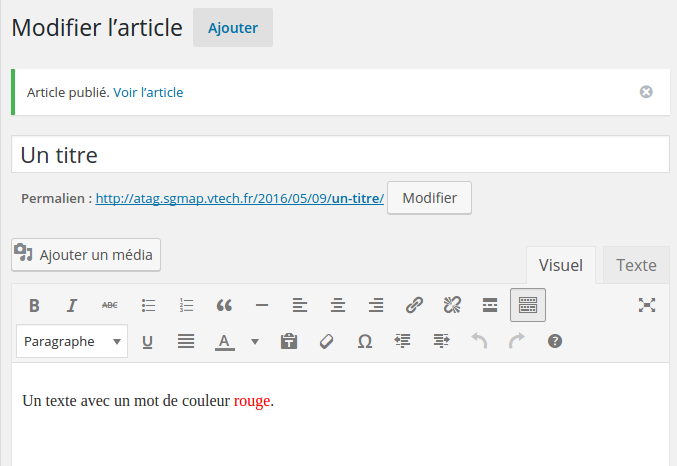

Devrait rendre :

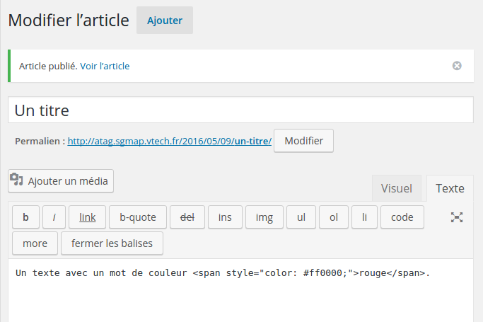

----

### Critère 4.4 [A] Chaque fonctionnalité de [prévisualisation](https://github.com/DISIC/referentiel-cms/blob/master/glossaire.md#Gprevisualisation) utilise-t-elle un [agent utilisateur](https://github.com/DISIC/referentiel-cms/blob/master/glossaire.md#GagentUtilisateur) au moins aussi accessible que ceux utilisés habituellement par les utilisateurs&nbsp;?

#### Test 4.4.1

1. Chaque fonctionnalité de prévisualisation doit vérifier une de ces conditions :
	* la prévisualisation est réalisée par un agent utilisateur du marché ;
	* la prévisualisation respecte les recommandations UAAG 1.0 de niveau A.
2. Si c'est le cas, le test est validé.

----

### Critère 4.5 [AAA] Pour chaque fonctionnalité de [prévisualisation](https://github.com/DISIC/referentiel-cms/blob/master/glossaire.md#Gprevisualisation), l'auteur peut-il choisir l'[agent utilisateur](https://github.com/DISIC/referentiel-cms/blob/master/glossaire.md#GagentUtilisateur) à utiliser&nbsp;?

#### Test 4.5.1

1. Vérifier que, pour chaque fonctionnalité de prévisualisation, l'auteur peut choisir son agent utilisateur. Par exemple :
	* choisir un navigateur web ;
	* choisir une extension de navigateur ;
	* choisir un lecteur multimédia.
2. Si c'est le cas, le test est validé.

----

### Critère 4.6 [AAA] Une action ne doit pas requérir de limite de temps pour être réalisée. Cette règle est-elle respectée&nbsp;?

#### Test 4.6.1

1. Lister un ensemble d'actions suivant un échantillon à définir (modification de profil, écriture d'un article/page, publication de contenus, modération de commentaire, etc.).
2. Vérifier, pour chacune de ces actions, qu'il n'y a pas de limite de temps.
3. Si c'est le cas, le test est validé.

----

### Critère 4.7 [A] L'utilisateur a-t-il le contrôle de chaque limite de temps d'une session ([hors cas particuliers](cas-particuliers.md#CP-c4.7))&nbsp;?

#### Test 4.7.1

1. Vérifier, dans l'outil, la présence de procédés limitant le temps d'une session.
2. Chaque procédé limitant le temps d'une session doit vérifier une de ces conditions :
	* l'auteur peut désactiver la limite de temps ;
	* l'outil sauvegarde automatiquement les modifications de l'auteur avant la fin de la limite de temps ;
	* l'auteur peut augmenter la limite de temps avant la redirection, de dix fois, au moins ;
	* l'auteur est averti de l'imminence de la redirection et dispose de vingt secondes, au moins, pour augmenter la limite de temps avant la prochaine redirection ;
	* la limite de temps avant la redirection est de vingt heures, au moins.
3. Si c'est le cas, le test est validé.

----

### Critère 4.8 [AAA] L'outil sauvegarde-t-il automatiquement les modifications de l'auteur&nbsp;?

#### Test 4.8.1

1. Modifier différents types de contenu.
2. Quitter l'édition de ce contenu sans avoir sauvegardé.
3. Vérifier si le contenu quitté en cours d'édition a tout de même été sauvegardé.
4. Si c'est le cas, le test est validé.

---

## 5 - Aide à la réparation

### Critère 5.1 [A] Pour chaque contenu éditable susceptible de contenir une non-conformité de niveau RGAA&nbsp;3.0 A, l'outil propose-t-il un [test d'accessibilité](https://github.com/DISIC/referentiel-cms/blob/master/glossaire.md#GtestAccessibilite)&nbsp;?

#### Test 5.1.1

1. Vérifier la présence d'une méthodologie de test pour le RGAA 3.0 pour les critères de niveau A.
2. Si c'est le cas, le critère est validé.

#### Commentaire

Étant donné qu'un test d'accessibilité peut être automatique, semi-automatique ou manuel, et qu'aucun test automatique ou semi-automatique ne couvre tous les critères A du RGAA 3.0 (à ce jour), la présence d'un test manuel est donc obligatoire.
Cependant, la présence de simples liens vers le référentiel et la méthodologie de test du RGAA 3.0 n'est pas considérée comme acceptable. C'est à l'outil de fournir directement les instructions pour réaliser les tests nécessaires.

#### Exemple

Lors de l'insertion d'une image, si le champ "description de l'image" n'est pas rempli, à la validation de l'insertion, l'outil bloque la validation et envoie un message d'alerte "Les images doivent avoir une description, sauf si la description est marquée non nécessaire." Le système de gestion de contenu effectue un test sur une potentielle non-conformité. L'auteur valide ensuite et l'image est insérée.

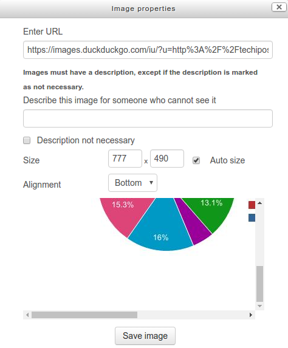

----

### Critère 5.2 [AA] Pour chaque contenu éditable susceptible de contenir une non-conformité de niveau RGAA&nbsp;3.0 AA, l'outil propose-t-il un [test d'accessibilité](https://github.com/DISIC/referentiel-cms/blob/master/glossaire.md#GtestAccessibilite)&nbsp;?

#### Test 5.2.1

1. Vérifier la présence d'une méthodologie de test pour le RGAA 3.0 pour les critères de niveau AA.
2. Si c'est le cas, le critère est validé.

#### Commentaire

Étant donné qu'un test d'accessibilité peut être automatique, semi-automatique ou manuel, et qu'aucun test automatique ou semi-automatique ne couvre tous les critères AA du RGAA 3.0 (à ce jour), la présence d'un test manuel est donc obligatoire.
Cependant, la présence de simples liens vers le référentiel et la méthodologie de test du RGAA 3.0 n'est pas considérée comme acceptable. C'est à l'outil de fournir directement les instructions pour réaliser les tests nécessaires.

#### Exemple

Dans l'exemple ci-dessous, l'outil propose un contrôle d'accessibilité, et par exemple, il teste les contrastes des textes avec le fond ; et si le texte n'est pas suffisamment contrasté, l'avertissement suivant apparaît : "Les couleurs du texte et du fond du texte ne sont pas suffisamment contrastées. Pour supprimer cet avertissement, veuillez changer soit la couleur du texte, soit celle du fond du texte, afin d'améliorer la lisibilité."

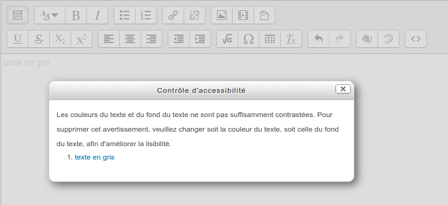

----

### Critère 5.3 [AAA] Pour chaque contenu éditable susceptible de contenir une non-conformité de niveau RGAA&nbsp;3.0 AAA, l'outil propose-t-il un [test d'accessibilité](https://github.com/DISIC/referentiel-cms/blob/master/glossaire.md#GtestAccessibilite)&nbsp;?

#### Test 5.3.1

1. Vérifier la présence d'une méthodologie de test pour le RGAA 3.0 pour les critères de niveau AAA.
2. Si c'est le cas, le critère est validé.

#### Commentaire

Étant donné qu'un test d'accessibilité peut être automatique, semi-automatique ou manuel, et qu'aucun test automatique ou semi-automatique ne couvre tous les critères AAA du RGAA 3.0 (à ce jour), la présence d'un test manuel est donc obligatoire.
Cependant, la présence de simples liens vers le référentiel et la méthodologie de test du RGAA 3.0 n'est pas considérée comme acceptable. C'est à l'outil de fournir directement les instructions pour réaliser les tests nécessaires.

----

### Critère 5.4 [A] Pour chaque non-conformité relevée par un [test d'accessibilité](https://github.com/DISIC/referentiel-cms/blob/master/glossaire.md#GtestAccessibilite) qui nécessite d'être vérifiée par l'auteur, l'outil propose-t-il des aides à la décision&nbsp;?

#### Test 5.4.1, 5.4.2

1. Rechercher la présence de tests d'accessibilité nécessitant d'être vérifié par l'auteur
2. Pour chacun des tests nécessitant d'être vérifié par l'auteur, l'outil doit proposer une aide à la décision.
3. Pour chacun des tests nécessitant d'être vérifié par l'auteur, l'auteur doit disposer d'un moyen pour retrouver l'élément concerné dans le contenu ;
4. Si c'est le cas, le critère est validé.

#### Exemple

Dans l'exemple du [critère 5.1](#crit%C3%A8re-51-a-pour-chaque-contenu-%C3%A9ditable-susceptible-de-contenir-une-non-conformit%C3%A9-de-niveau-rgaa-30-a-loutil-propose-t-il-un-test-daccessibilit%C3%A9-) sur la présence de test d'accessibilité, lors de l'insertion d'une image dans Moodle, se trouve une aide à la décision.
A côté du champ d'insertion de l'image, il est affiché : "Les images doivent avoir une description, sauf si la description est marquée comme non nécessaire", ceci constitue une aide à la décision.

#### Commentaire

Si aucun des tests relatifs aux critères 5.1, 5.2 et 5.3 n'est applicable, ce test ne peut non plus être applicable.

----

### Critère 5.5 [A] Pour chaque non-conformité de niveau RGAA&nbsp;3.0 A relevée par un [test d'accessibilité](https://github.com/DISIC/referentiel-cms/blob/master/glossaire.md#GtestAccessibilite), l'auteur dispose-t-il de [moyens pour réparer](https://github.com/DISIC/referentiel-cms/blob/master/glossaire.md#GmoyensReparation)&nbsp;?

#### Test 5.5.1

1. Vérifier la présence de tests d'accessibilité.
2. Vérifier, pour chaque non conformité de niveau A, que l'auteur dispose de moyens pour réparer, par exemple :
	* l'outil répare automatiquement l'erreur ;
	* l'outil met à disposition de l'auteur des suggestions de réparations ;
	* l'outil met à disposition de l'auteur des explications lui permettant d'effectuer la réparation.
3. Si c'est le cas, le critère est validé.

#### Exemple

Capture d'écran de la saisie du test d'accessibilité du plugin "Accessibility checker" de l'éditeur de contenu CKEditor. CKEditor où, à la suite du test d'accessibilité, l'outil propose de saisir directement une alternative d'image lors du résultat du test d'accessibilité.

#### Commentaire

Si aucun des tests relatifs aux critères 5.1, 5.2 et 5.3 n'est applicable, ce test ne peut non plus être applicable.

----

### Critère 5.6 [AA] Pour chaque non-conformité de niveau RGAA&nbsp;3.0 AA relevée par un [test d'accessibilité](https://github.com/DISIC/referentiel-cms/blob/master/glossaire.md#GtestAccessibilite), l'auteur dispose-t-il de [moyens pour réparer](https://github.com/DISIC/referentiel-cms/blob/master/glossaire.md#GmoyensReparation)&nbsp;?

#### Test 5.6.1

1. Vérifier la présence de tests d'accessibilité.
2. Vérifier, pour chaque non conformité de niveau AA, que l'auteur dispose de moyens pour réparer, par exemple :
	* l'outil répare automatiquement l'erreur ;
	* l'outil met à disposition de l'auteur des suggestions de réparation ;
	* l'outil met à disposition de l'auteur des explications lui permettant d'effectuer la réparation.
3. Si c'est le cas, le critère est validé.

#### Commentaire

Si aucun des tests relatifs aux critères 5.1, 5.2 et 5.3 n'est applicable, ce test ne peut non plus être applicable.

----

### Critère 5.7 [AAA] Pour chaque non-conformité de niveau RGAA&nbsp;3.0 AAA relevée par un [test d'accessibilité](https://github.com/DISIC/referentiel-cms/blob/master/glossaire.md#GtestAccessibilite), l'auteur dispose-t-il de [moyens pour réparer](https://github.com/DISIC/referentiel-cms/blob/master/glossaire.md#GmoyensReparation)&nbsp;?

#### Test 5.7.1

1. Vérifier la présence de tests d'accessibilité.
2. Vérifier, pour chaque non conformité de niveau AAA, que l'auteur dispose de moyens pour réparer, par exemple :
	* l'outil répare automatiquement l'erreur ;
	* l'outil met à disposition de l'auteur des suggestions de réparations ;
	* l'outil met à disposition de l'auteur des explications lui permettant d'effectuer la réparation.
3. Si c'est le cas, le critère est validé.

#### Commentaire

Si aucun des tests relatifs aux critères 5.1, 5.2 et 5.3 n'est applicable, ce test ne peut non plus être applicable.

----

### Critère 5.8 [AA] À l'issue de [tests d'accessibilité](https://github.com/DISIC/referentiel-cms/blob/master/glossaire.md#Grapportaccessibilite), un [rapport d'accessibilité](https://github.com/DISIC/referentiel-cms/blob/master/glossaire.md#Grapportaccessibilite) des contenus est-il disponible&nbsp;?

#### Test 5.8.1

1. Vérifier la présence de tests d'accessibilité.
2. A l'issue des tests d'accessibilité, vérifier qu'un rapport présentant la liste des problèmes d'accessibilité rencontrés est disponible.
3. Si c'est le cas, le critère est validé.

#### Commentaires

* Si aucun des tests relatifs aux critères 5.1, 5.2 et 5.3 n'est applicable, ce test ne peut non plus être applicable.
* Le format du rapport et le moyen de mise à disposition de l'auteur ne sont pas contraints.

----

### Critère 5.9 [AA] Chaque résultat d'un [test d'accessibilité](https://github.com/DISIC/referentiel-cms/blob/master/glossaire.md#Grapportaccessibilite) est-il associé au contenu correspondant&nbsp;?

#### Test 5.9.1

1. Vérifier la présence de tests d'accessibilité.
2. A l'issue des tests d'accessibilité, vérifier que chaque résultat d'un test d'accessibilité est associé au contenu correspondant, par exemple via un lien qui permet, depuis le résultat, d'accéder au contenu en question, ou via la présence d'un texte adjacent au contenu en erreur.
3. Si c'est le cas, le critère est validé.

#### Exemple

Capture d'écran de la saisie du test d'accessibilité du plugin "Accessibility checker" de l'éditeur de contenu CKEditor. CKEditor où, à la suite du test d'accessibilité, l'outil affiche le résultat du test d'accessiblité associé au contenu correspondant.

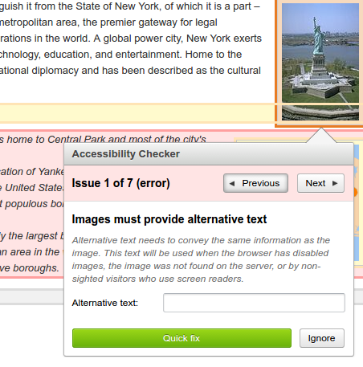

#### Commentaire

Si aucun des tests relatifs aux critères 5.1, 5.2 et 5.3 n'est applicable, ce test ne peut non plus être applicable.

---

## 6 - Édition

### Critère 6.1 [A] Toutes les [modifications sur le contenu](https://github.com/DISIC/referentiel-cms/blob/master/glossaire.md#GmodificationContenu) réalisées par l'auteur sont-elles [réversibles](https://github.com/DISIC/referentiel-cms/blob/master/glossaire.md#Gactionreversible)&nbsp;?

#### Test 6.1.1

1. Vérifier que l'auteur peut annuler toutes ses modifications sur le contenu avec, par exemple, des boutons d'action de type "annuler", "revenir à l'état précédent" ou encore voir si la fonctionnalité "annuler" de l'agent utilisateur est opérationnelle dans l'outil d'édition.
2. Ou vérifier que chaque modification de contenu par l'auteur demande une confirmation avant d'être exécutée.
3. Si c'est le cas, le test est validé.

----

### Critère 6.2 [AAA] Toutes les [modifications sur le contenu](https://github.com/DISIC/referentiel-cms/blob/master/glossaire.md#GmodificationContenu) réalisées par l'auteur sont-elles [réversibles](https://github.com/DISIC/referentiel-cms/blob/master/glossaire.md#Gactionreversible)&nbsp;?

#### Test 6.2.1

1. Vérifier que l'auteur peut annuler toutes ses modifications sur le contenu avec, par exemple, des boutons d'actions de type "annuler", "revenir à l'état précédent" ou encore voir si la fonctionnalité "annuler" de l'agent utilisateur est opérationnelle dans l'outil d'édition.
2. Si c'est le cas, le test est validé.

----

### Critère 6.3 [A] La [fonctionnalité de copier-coller](https://github.com/DISIC/referentiel-cms/blob/master/glossaire.md#GcopierColler) conserve-t-elle les [informations d'accessibilité](https://github.com/DISIC/referentiel-cms/blob/master/glossaire.md#GinformationsAccessibilite) de niveau A du RGAA&nbsp;3.0 ([hors cas particuliers](cas-particuliers.md#CP-c6.3.4.5))&nbsp;?

#### Test 6.3.1

1. Vérifier que le copier/coller, respecte les recommandations des critères de niveau A du [référentiel technique RGAA 3.0](http://references.modernisation.gouv.fr/referentiel-technique-0).
2. Si c'est le cas, le test est validé.

#### Exemple

Par exemple lors de la copie d'une image, le texte collé, doit aussi copier aussi le texte alternatif.

----

### Critère 6.4 [AA] La [fonctionnalité de copier-coller](https://github.com/DISIC/referentiel-cms/blob/master/glossaire.md#GcopierColler) conserve-t-elle les [informations d'accessibilité](https://github.com/DISIC/referentiel-cms/blob/master/glossaire.md#GinformationsAccessibilite) de niveau RGAA&nbsp;3.0 AA ([hors cas particuliers](cas-particuliers.md#CP-c6.3.4.5))&nbsp;?

#### Test 6.4.1

1. Vérifier que le copier/coller, respecte les recommandations des critères de niveau AA du [référentiel technique RGAA 3.0](http://references.modernisation.gouv.fr/referentiel-technique-0).
2. Si c'est le cas, le test est validé.

#### Exemple

Par exemple lors de la copie d'un texte où la langue change (et ce changement de langue est indiqué à l'aide de l'attribut `lang=""`), le texte collé ne doit pas perdre cet attribut.

----

### Critère 6.5 [AAA] La [fonctionnalité de copier-coller](https://github.com/DISIC/referentiel-cms/blob/master/glossaire.md#GcopierColler) conserve-t-elle les [informations d'accessibilité](https://github.com/DISIC/referentiel-cms/blob/master/glossaire.md#GinformationsAccessibilite) de niveau RGAA&nbsp;3.0 AAA ([hors cas particuliers](cas-particuliers.md#CP-c6.3.4.5))&nbsp;?

#### Test 6.5.1

1. Vérifier que le copier/coller, respecte les recommandations des critères de niveau AAA du [référentiel technique RGAA 3.0](http://references.modernisation.gouv.fr/referentiel-technique-0).
2. Si c'est le cas, le test est validé.

#### Exemple

Par exemple lors de la copie d'un texte où se trouve une abréviation (et celle est définie à l'aide de l'attribut ``<abbr>`), le texte collé ne doit pas perdre cet attribut.

----

### Critère 6.6 [A] [L'outil](https://github.com/DISIC/referentiel-cms/blob/master/glossaire.md#GoutilEdition) permet-il de définir des informations d'accessibilité de niveau RGAA&nbsp;3.0 A ([hors cas particuliers](cas-particuliers.md#CP-c6.6.7.8))&nbsp;?

#### Tests 6.6.1, 6.6.2

1. Vérifier, si il est possible de définir des informations d'accessibilité de niveau A.
2. Si c'est le cas, le test est validé.

#### Exemple

Dans le cas d'ajout d'une image de décoration, vérifeir qu'il est possible de laisser le champ alt vide sans que l'attribut `alt=""` ne soit supprimé de la balise à son insertion dans le contenu.

Commentaire :
CF. Methodologie [référentiel CMS critère 6.6](https://github.com/DISIC/referentiel-cms/blob/master/criteres.md#c6-6)

----

### Critère 6.7 [AA] [L'outil](https://github.com/DISIC/referentiel-cms/blob/master/glossaire.md#GoutilEdition) permet-il de définir des informations d'accessibilité de niveau RGAA&nbsp;3.0 AA ([hors cas particuliers](cas-particuliers.md#CP-c6.6.7.8))&nbsp;?

#### Tests 6.7.1, 6.7.2

1. Vérifier, si il est possible de définir des informations d'accessibilité de niveau AA.
2. Si c'est le cas, le test est validé.

#### Exemple

Dans le cas d'un formulaire, vérifier qu'il est possible d'ajouter des suggestions facilitant la correction des erreurs de saisie.

----

### Critère 6.8 [AAA] [L'outil](https://github.com/DISIC/referentiel-cms/blob/master/glossaire.md#GoutilEdition) permet-il de définir des informations d'accessibilité de niveau RGAA&nbsp;3.0 AAA ([hors cas particuliers](cas-particuliers.md#CP-c6.6.7.8))&nbsp;?

#### Tests 6.8.1, 6.8.2

1. Vérifier, si il est possible de définir des informations d'accessibilité de niveau AA.
2. Si c'est le cas, le test est validé.

#### Exemple

Vérifier, qu'il est possible de définir les abréviations afin d'en connaître la signification ou qu'il est possible, pour chaque formulaire, de renseigner des aides à la saisie.

----

### Critère 6.9 [A] Les alternatives textuelles réparées automatiquement par l'outil restent contrôlables. Cette règle est-elle respectée&nbsp;?

#### Tests 6.9.1, 6.9.2, 6.9.3

1. Insérer des images dans les différentes zones d'édition de l'outil.
2. Vérifier que :
	* l'outil n'insère pas d'alternatives textuelles non pertinentes ;
	* lors de l'insertion d'image dans les zones d'édition, des alternatives d'images ne sont pas automatiquement générées dans les gabarits du Front-Office ;
	* les alternatives textuelles réparées automatiquement après/pendant une session d'édition respectent ces conditions :
		* l'auteur peut valider la réparation automatique avant son insertion dans le contenu ;
		* l'auteur peut modifier l'alternative textuelle réparée automatiquement avant son insertion dans le contenu ;
		* l'auteur peut refuser l'alternative textuelle réparée automatiquement avant son insertion dans le contenu.
2. Si c'est le cas, le test est validé.

#### Commentaire :

Lors de l'insertion d'images, par exemple dans les zones d'édition, l'auteur doit être averti et peut modifier les alternatives réparées automatiquement par l'outil.
Pour tester, il faut insérer une image dans les différentes zones d'édition, en laissant l'alternative vide.

----

### Critère 6.10 [AAA] Les alternatives textuelles renseignées par l'auteur sont-elles sauvegardées&nbsp;?

#### Test 6.10.1, 6.10.2, 6.10.3

1. Vérifier que, lors de l'insertion d'une image, l'auteur peut saisir une alternative, celle-ci doit pouvoir être éditée et effacée.
2. Si jamais l'image est insérée via une médiathèque, l'outil doit proposer de saisir une nouvelle alternative relative au contenu dans lequel elle est insérée.
3. Si c'est le cas, le test est validé.

#### Commentaire :

Attention, si l'image est insérée via une médiathèque, la modification de l'alternative d'une image ne doit pas avoir d'impact sur les autres endroits où est inséré ce média.

---

## 7 - Gabarits et contenus pré-conçus

### Critère 7.1 [A] Les [gabarits](https://github.com/DISIC/referentiel-cms/blob/master/glossaire.md#Ggabarit) fournis par l'outil sont-ils accessibles&nbsp;?

#### Test 7.1.1

1. Vérifier la présence de gabarits.
2. Pour chaque gabarit, tester le respect des recommandations des critères de niveau A du [référentiel technique RGAA 3.0](http://references.modernisation.gouv.fr/referentiel-technique-0).
3. Si c'est le cas, le test est validé.

----

### Critère 7.2 [AA] Les [gabarits](https://github.com/DISIC/referentiel-cms/blob/master/glossaire.md#Ggabarit) fournis par l'outil sont-ils accessibles&nbsp;?

#### Test 7.2.1

1. Vérifier la présence de gabarits.
2. Pour chaque gabarit, tester le respect des recommandations des critères de niveau AA du [référentiel technique RGAA 3.0](http://references.modernisation.gouv.fr/referentiel-technique-0).
3. Si c'est le cas, le test est validé.

----

### Critère 7.3 [AAA] Les [gabarits](https://github.com/DISIC/referentiel-cms/blob/master/glossaire.md#Ggabarit) fournis par l'outil sont-ils accessibles&nbsp;?

#### Test 7.3.1

1. Vérifier la présence de gabarits.
2. Pour chaque gabarit, tester le respect des recommandations des critères de niveau AAA du [référentiel technique RGAA 3.0](http://references.modernisation.gouv.fr/referentiel-technique-0).
3. Si c'est le cas, le test est validé.

----

### Critère 7.4 [AA] Le système de sélection des [gabarits](https://github.com/DISIC/referentiel-cms/blob/master/glossaire.md#Ggabarit) permet-il de distinguer les [gabarits](https://github.com/DISIC/referentiel-cms/blob/master/glossaire.md#Ggabarit) accessibles&nbsp;?

#### Test 7.4.1

1. Vérifier la présence de gabarits.
2. Si tous les gabarits ne sont pas accessibles, ils doivent être distingués des autres gabarits.
3. Si un type de gabarit est signalé, il doit l'être de façon accessible (via un moteur de recherche, une légende, etc.).
4. Si c'est le cas, le test est validé.

----

### Critère 7.5 [AAA] Tous les [gabarits](https://github.com/DISIC/referentiel-cms/blob/master/glossaire.md#Ggabarit) fournis par l'outil sont accessibles au moins au niveau RGAA&nbsp;3.0 AA. Cette règle est-elle respectée&nbsp;?

#### Test 7.5.1

1. Vérifier la présence de gabarits.
2. Pour chaque gabarit fourni, tester le respect des recommandations des critères de niveau AA du [référentiel technique RGAA 3.0](http://references.modernisation.gouv.fr/referentiel-technique-0).
3. Si c'est le cas, le test est validé.

----

### Critère 7.6 [AA] Dans chaque ensemble de [contenus pré-conçus](https://github.com/DISIC/referentiel-cms/blob/master/glossaire.md#GcontenusPreconcus), des contenus pré-conçus accessibles sont-ils proposés&nbsp;?

#### Test 7.6.1, 7.6.2

1. Vérifier la présence de contenus pré-conçus.
2. Vérifier si les contenus pré-conçus sont accessibles et respectent les recommandations des critères de niveau AA du référentiel technique RGAA 3.0.
3. Si tous les contenus préconçus ne sont pas accessibles, ils doivent être distingués des autres contenus pré-conçus. Si un contenu pré-conçu est signalé, il doit l'être de façon accessible.
4. Si c'est le cas, le test est validé.

#### Exemple

dans le cas d'un formulaire de contact pré-conçu (Cf. capture ci-contre), le contenu accessible est identifié :

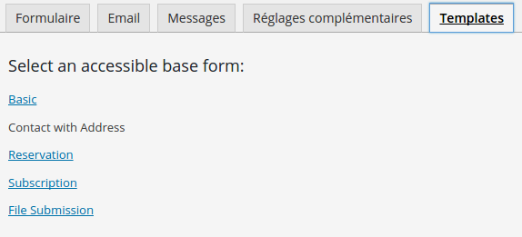

---

## 8 - Documentation

#### Commentaire général :

La notion de documentation doit être prise ici au sens large, elle peut être fournie par plusieurs moyens :

* directement dans l'outil ;
* via un lien sur le site de l'éditeur ;
* etc ;

et sous plusieurs formes :

* documentation ;
* instructions d'installation ;
* échantillons ;
* tutoriels ;
* etc.

----

### Critère 8.1 [AAA] Pour chaque commande au clavier, l'outil fournit-il une [documentation de la fonctionnalité associée](https://github.com/DISIC/referentiel-cms/blob/master/glossaire.md#Gmoyenrecuperationfonctionnaliteclavier)&nbsp;?

#### Test 8.1.1

1. Rechercher dans l'outil une documentation sur les raccourcis au clavier disponibles.
2. Si cette documentation est présente et pertinente, le test est validé.

#### Commentaire :

Le contenu de cette documentation ne doit pas reprendre les raccourcis clavier de l'agent utilisateur utilisé.

----

### Critère 8.2 [A] Toutes les [fonctionnalités d'aide à l'accessibilité](https://github.com/DISIC/referentiel-cms/blob/master/glossaire.md#GfonctionnaiteAideAccessibilite) de l'outil sont-elles documentées&nbsp;?

#### Test 8.2.1

1. Rechercher dans l'outil les fonctionnalités d'aide à l'accessibilité
2. Cette documentation peut être fournie :
	* via la documentation générale de l'outil ;
	* ou via l'interface au même endroit que chaque fonctionnalité documentée ;
	* ou bien cette documentation peut être fournie par la plateforme ;
3. Si cette documentation est présente et pertinente, le test est validé.

----

### Critère 8.3 [AA] Toutes les fonctionnalités de l'[interface](https://github.com/DISIC/referentiel-cms/blob/master/glossaire.md#Ginterface) sont-elles documentées&nbsp;?

#### Test 8.3.1

1. Vérifier qu'il existe une documentation de toutes les fonctionnalités de l'interface.
2. Cette documentation peut être fournie :
	* via la documentation générale de l'outil ;
	* ou via l'interface au même endroit que chaque fonctionnalité documentée ;
	* ou bien cette documentation peut être fournie par la plateforme ;
3. Si cette documentation est présente et pertinente, le test est validé.

----

### Critère 8.4 [A] L'outil met à disposition des [instructions d'utilisation](https://github.com/DISIC/referentiel-cms/blob/master/glossaire.md#GinstructionsUtilisation) des [fonctionnalités d'aide à l'accessibilité](https://github.com/DISIC/referentiel-cms/blob/master/glossaire.md#GfonctionnaiteAideAccessibilite). Cette règle est-elle respectée&nbsp;?

#### Test 8.4.1

1. Repérer les fonctionnalités d'aide à l'accessibilité.
2. Tester si les instructions fournissent des indications techniques pour la création de contenus accessibles.
3. Si c'est le cas, le test est validé.

#### Exemple :

Le choix de couleurs pour le respect du contraste : "Le ratio de contraste de luminosity pour `#863232` et `#e72727` est 1.87:1 (Seuil : supérieur à 7:1 niveau AAA, 4.5:1 niveau AA)"

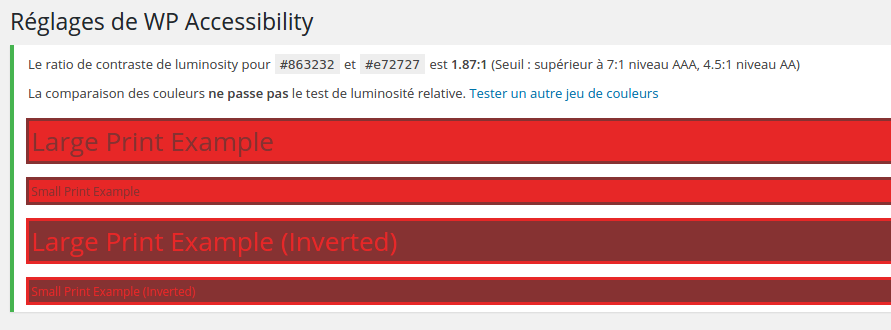

----

### Critère 8.5 [AAA] [La documentation de l'outil](https://github.com/DISIC/referentiel-cms/blob/master/glossaire.md#GdocumentationOutil) contient un index des [fonctionnalités d'aide à l'accessibilité](https://github.com/DISIC/referentiel-cms/blob/master/glossaire.md#GfonctionnaiteAideAccessibilite). Cette règle est-elle respectée&nbsp;?

#### Test 8.5.1

1. Rechercher une documentation de l'outil.
2. Vérifier que la documentation contient un index dédié aux fonctionnalités d'aide à l'accessibilité.
3. Si c'est le cas, le test est validé.

----

### Critère 8.6 [AAA] Un tutoriel d'aide à la création de contenus accessibles via les fonctionnalités de [l'outil](https://github.com/DISIC/referentiel-cms/blob/master/glossaire.md#GoutilEdition) est-il mis à disposition&nbsp;?

#### Test 8.6.1

1. Rechercher dans l'outil un tutoriel d'aide à la création de contenus accessibles (article de blog, article e-commerce, vidéo etc.).
2. Si c'est le cas, le test est validé.

----

### Critère 8.7 [A] [La documentation](https://github.com/DISIC/referentiel-cms/blob/master/glossaire.md#GdocumentationOutil) intègre-t-elle des [exemples de contenus accessibles](https://github.com/DISIC/referentiel-cms/blob/master/glossaire.md#Gexempledecontenuaccessible) de niveau RGAA&nbsp;3.0 A&nbsp;?

#### Test 8.7.1

1. Vérifier que la documentation intègre au moins un exemple de contenus accessibles de niveau A, cela peut être :
	* un exemple directement saisi mis à disposition de l'auteur pour consultation ;
	* des modèles de contenus préparés a priori mis à disposition dans les zones d'édition ;
	* des images (captures d'écran) illustrant l'utilisation des fonctionnalités d'accessibilité dans les zones d'édition.
2. Si c'est le cas, le test est validé.

----

### Critère 8.8 [AA] [La documentation](https://github.com/DISIC/referentiel-cms/blob/master/glossaire.md#GdocumentationOutil) intègre-t-elle des [exemples de contenus accessibles](https://github.com/DISIC/referentiel-cms/blob/master/glossaire.md#Gexempledecontenuaccessible) de niveau RGAA&nbsp;3.0 AA&nbsp;?

#### Test 8.8.1

1. Vérifier que la documentation intègre au moins un exemple de contenus accessibles de niveau AA, cela peut être :
	* un exemple directement saisi mis à disposition de l'auteur pour consultation ;
	* des modèles de contenus préparés a priori mis à disposition dans les zones d'édition ;
	* des images (captures d'écran) illustrant l'utilisation des fonctionnalités d'accessibilité dans les zones d'édition.
2. Si c'est le cas, le test est validé.

----

### Critère 8.9 [AAA] [La documentation](https://github.com/DISIC/referentiel-cms/blob/master/glossaire.md#GdocumentationOutil) intègre-t-elle des [exemples de contenus accessibles](https://github.com/DISIC/referentiel-cms/blob/master/glossaire.md#Gexempledecontenuaccessible) de niveau RGAA&nbsp;3.0 AAA&nbsp;?

#### Test 8.9.1

1. Vérifier que la documentation intègre au moins un exemple de contenus accessibles de niveau AAA, cela peut être :
	* un exemple directement saisi mis à disposition de l'auteur pour consultation ;
	* des modèles de contenus préparés a priori mis à disposition dans les zones d'édition ;
	* des images (captures d'écran) illustrant l'utilisation des fonctionnalités d'accessibilité dans les zones d'édition.
2. Si c'est le cas, le test est validé.

---

## Licence d'utilisation

Ce document est la propriété du Secrétariat général à la modernisation de l'action publique français (SGMAP). Il est placé sous la [licence ouverte 1.0 ou ultérieure](https://www.etalab.gouv.fr/licence-ouverte-open-licence), équivalente à une licence Creative Commons BY. Pour indiquer la paternité, ajouter un lien vers la version originale du document disponible sur le [compte GitHub de la DInSIC](https://github.com/DISIC).
